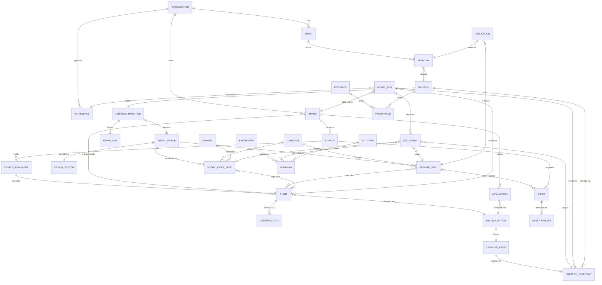

# NABCor Domain Model

**Version:** 1.2 · 2026-07-17 · canonical domain language for all code, contracts,
prompts, and documentation. Semantic clarity, not database design — storage decisions
come in Phase 1+ with their own decision records.

**Entity classes:** `canonical` (source of truth, versioned, lifecycle-tracked) ·
`derived` (recomputable from canonical entities; may be cached) · `temporary`
(working memory; summarized or archived after use — Second Brain Layer 2).

**Common envelope.** Every canonical artifact carries the envelope fields defined in
`contracts/artifact-envelope.schema.json`: `schema_version`, `artifact_id`, `brand_ref`
(and `project_ref` where applicable), `created_at`, `creator_type`
(`human | agent | deterministic`), `lifecycle_status`, `supersedes`/`superseded_by`,
`derived_from_runs`, and — where applicable — `provenance`, `confidence`,
`validation_status`, `approvals`. Versioning rule for all canonical artifacts:
immutable per version; a revision creates a new version linked by supersession
(INV-VER-001).

---

## 1. Identity and tenancy

### Workspace
- **Purpose:** one operating environment (a machine, cloud session pool, or team space)
  where runs execute. Attribution boundary component (INV-OBS-001).
- **Required:** `workspace_id`, kind (`local | cloud | ci`).
- **Relationships:** has many Model Runs.
- **Lifecycle:** registered → active → retired. **Ownership:** Organization.
- **Class:** canonical (registry entry). BC-001 lesson: a workspace shared by two
  products inflated naive attribution ~12% (L08).

### Organization
- **Purpose:** the paying/operating entity (Nabtiq; later, a studio tenant).
- **Required:** `org_id`, name.
- **Relationships:** has Users, Workspaces, Brands.
- **Lifecycle:** created → active → offboarded (offboarding deletes brand namespaces —
  INV-DATA-001). **Class:** canonical.

### User
- **Purpose:** a human actor; the authority behind every human gate.
- **Required:** `user_id`, role (`operator | reviewer | client-contact | admin`).
- **Relationships:** member of Organization; author of Approvals, Decisions, Feedback.
- **Lifecycle:** invited → active → deactivated. **Class:** canonical.
- Note: no auth system exists yet (NON_GOALS §1); the entity exists so approvals name
  a human from day one.

### Brand
- **Purpose:** the client identity everything belongs to; the isolation namespace
  (INV-DATA-001) and the memory boundary.
- **Required:** `brand_id`, name(s) (bilingual where applicable), organization.
- **Relationships:** owns Sources, Claims, Brand Context, Directions, Campaigns,
  Assets, Decisions, Preferences, Learnings (brand-scoped ones).
- **Lifecycle:** created → active → archived → deleted (offboarding).
- **Class:** canonical.

## 2. Truth layer

### Source
- **Purpose:** one client-provided or externally-acquired input (document, image,
  logo, URL, brief) with classification, technical facts, and rights.
- **Required:** `source_id`, kind (`document | image | logo | reference | url | prompt |
  brief | video | other`), origin (`client | operator | generated | licensed`), rights
  block (`commercial_use / advertising_use / benchmark_use / training_use` — last two
  default-deny, INV-DATA-002), technical facts for assets (`has_alpha`,
  `vector_available`, resolution, aspect ratio — F04), `injection_flag` for suspected
  embedded instructions (INV-SEC-002), and a `capture` block (DEC-0006) stating
  honestly how much of the input the runtime holds: `captured` (content-addressed
  bytes with digest, size, media type, safety state), `descriptor-only`, or
  `external-unfetched`. Visual kinds state `visual_classification` explicitly;
  `null` is the unresolved state — documentary is never a default (INV-FACT-003).
- **Relationships:** owns at most one Captured Content blob per version; yields
  Source Fragments; referenced by Claims and Assets.
- **Lifecycle:** ingested → classified → (mined) → retained | quarantined.
- **Class:** canonical. Contract: `contracts/source.schema.json`.

### Captured Content
- **Purpose:** the immutable bytes behind a captured source — the thing a claim
  fragment is audited against (DEC-0006).
- **Required:** SHA-256 digest (also the address), byte size, safety namespace
  (`clear | quarantine`), workspace/brand namespace.
- **Relationships:** referenced by exactly one field, `capture.content_ref`, on
  Source artifacts; read by the brand-context compiler for fragment verification.
- **Lifecycle:** written once before its source artifact exists; never mutated;
  deduplicated by digest within one brand namespace; quarantined blobs are
  fail-closed — no runtime path reads them, pending both a formally named
  independent reviewer and a ratified authenticated gate mechanism
  (DEC-0007, DEC-0008 — Q-001 is closed, but both release prerequisites are
  still missing); a recorded `quarantine-release` approval is
  audit metadata and grants no authority (INV-HUM-001).
- **Class:** canonical (immutable raw material; content-addressed file store).

### Source Fragment
- **Purpose:** an addressable region of a source (`source:src_0001#page=3`,
  `source:src_0002#codepoints=57-88`) so provenance is precise, not file-level.
  Fragment locators ride on canonical source-artifact references
  (DEC-0006/DEC-0007) — never on filenames. Code-point fragments are zero-based
  half-open Unicode code-point ranges `[start, end)` — never UTF-16 units,
  bytes, or grapheme clusters — verified against the Captured Content blob
  exactly as captured (no Unicode normalization); page fragments on descriptors
  are structurally valid but not-yet-content-verified.
- **Required:** `fragment_id`, `source_ref`, locator, extracted text/description.
- **Relationships:** cited by Claims and Evidence.
- **Class:** derived (recomputable by re-mining the source; IDs stable once cited).

### Evidence
- **Purpose:** the *support relation* — the link between a Claim and the fragments/runs
  that support or contradict it, with direction (`supports | contradicts`) and note.
- **Required:** claim ref, fragment/source/run ref, direction.
- **Class:** derived (stored inline on claims initially; see
  `docs/PROVENANCE_AND_CONFIDENCE.md`).

### Claim
- **Purpose:** one statement about the brand/world with classification, provenance,
  confidence, and verification state — the atom of factual integrity (INV-FACT-001/002).
- **Required:** `claim_id`, statement, classification (`factual | inference |
  hypothesis | preference`), `source_type`, provenance (for factual), confidence,
  `verification_status` (`verified | unconfirmed | contradicted | expired | rejected`),
  validity window.
- **Relationships:** cites Source Fragments (via Evidence); consumed by Brand Context,
  copy generation, G4 validation; contradicted claims pair via Contradiction.
- **Lifecycle:** extracted/proposed → (verified | unconfirmed) → possibly contradicted /
  expired / superseded. Human confirmation moves inference → verified (INV-HUM-001(3)).
- **Class:** canonical. Contract: `contracts/claim.schema.json`.

### Assumption
- **Purpose:** a working belief the system needs but cannot verify — with risk class,
  owner, and expiry. The prompt-only mode runs on these; they may never silently
  become architecture or fact (Master Prompt §14; BC-001 assumption-ledger lesson).
- **Required:** `assumption_id`, statement, risk (`low | medium | high`), owner,
  revisit trigger or expiry, status (`open | confirmed | retired | violated`).
- **Relationships:** referenced by Decisions, Brand Context, generated copy slots.
- **Class:** canonical. Contract: `contracts/assumption.schema.json`.

### Contradiction
- **Purpose:** a first-class record that two claims/sources disagree, surfaced to a
  human, resolved exactly once (BC-001 FAIL-04: the Josour/Nosour — transliterated —
  Arabic brand-name conflict class).
- **Required:** the conflicting claim refs, description, status
  (`open | resolved | accepted-both`), resolution decision ref when resolved.
- **Lifecycle:** detected → surfaced → resolved (via Decision) — losing claim becomes
  `contradicted`, never deleted.
- **Class:** canonical (stored as claim relationships + a decision on resolution).
- Detection today is the deterministic Tier-0 structured layer only
  (DEC-0011): explicit fact slots compared exactly, status fixed to `open`.
  Semantic detection over prose remains prohibited (DEC-0009).

### Truth Profile
- **Purpose:** the versioned declaration of the fact slots one workflow or Brand
  Context Package expects (DEC-0011) — per slot: fact key, description,
  cardinality (`single | multi`), requirement (`required | optional`),
  `why_needed`, and profile-owned blocking flags for missing and conflicting
  states. Workflow-scoped expectation, not a universal ontology: absence from
  a profile is not evidence that information is universally required. Carries
  no provider or model policy.
- **Required:** envelope, `brand_ref`, description, unique deterministically
  sorted slots.
- **Relationships:** referenced by Truth Analyses; brand-isolated
  (INV-DATA-001).
- **Class:** canonical. Contract: `contracts/truth-profile.schema.json`.

### Truth Analysis
- **Purpose:** the deterministic analyzer's result over one claim set and one
  truth profile (DEC-0011): open contradictions (exact type-sensitive
  distinct-value groups on single-cardinality slots), gaps
  (`missing | unverified`, profile-relative), and the explicit listings of
  unstructured and unprofiled claims. The single authoritative input for a
  Brand Context Package's contradictions and gaps (`truth_analysis_ref`).
- **Required:** envelope, `brand_ref`, truth-profile ref, analyzer version,
  exact analyzed claim refs, contradictions (status fixed `open`), gaps,
  unstructured/unprofiled claim listings.
- **Relationships:** derived from Claims + one Truth Profile; consumed by the
  brand-context compiler; contradictions resolve downstream via Decisions
  (INV-HUM-001(3)).
- **Class:** derived (recomputable; persisted because the compiler consumes
  it). Contract: `contracts/truth-analysis.schema.json`.

## 3. Decision and preference layer

### Decision
- **Purpose:** a durable, explainable choice (INV-DEC-001; Constitution P6) — direction
  selections, fact resolutions, architecture choices, scope changes.
- **Required:** per `contracts/decision.schema.json`: id, title, status, context,
  problem, options, selected option, reason, evidence, assumptions, consequences,
  risks, affected artifacts, revisit trigger, supersession, `decided_by`.
- **Relationships:** cites Claims/Assumptions/Evidence; affects Artifacts; supersedes
  prior Decisions; human-gated ones name a User.
- **Lifecycle:** proposed → ratified → (superseded | revisited).
- **Class:** canonical. Files: `brain/decisions/DEC-*.md` + schema instances.

### Preference
- **Purpose:** a remembered taste signal (client or operator) mined from selections,
  rejections, and feedback — "rejected both dark territories", "no serif display".
- **Required:** `preference_id`, subject (brand | user), statement, polarity, strength,
  source event (decision/feedback ref).
- **Relationships:** consulted by DIRECT-domain skills; feeds territory generation
  constraints.
- **Lifecycle:** observed → active → decayed/contradicted (preferences can expire —
  taste changes).
- **Class:** canonical (append-only log + current view). Stored in `brain/learnings/`
  format at foundation; schema formalization in Phase 1 if needed.

## 4. Creative layer

### Creative Brief
- **Purpose:** the structured statement of intent: objectives, audience (as claims/
  inferences), scope, constraints, success criteria. Mode A builds it from the prompt;
  Mode B from evidence + prompt.
- **Required:** objectives, audience refs, deliverables, constraints, tone signals,
  budget refs. **Class:** canonical. Contract: `contracts/creative-brief.schema.json`.

### Creative Territory
- **Purpose:** one candidate direction — concept, palette/type direction, imagery
  world, motion stance, rationale, sacrifices. Three per slice run, diversity-evaluated
  (EXP-0002).
- **Relationships:** belongs to a Brief; one becomes selected (Decision); rejected ones
  persist with reasons (preference memory).
- **Lifecycle:** generated → critiqued → presented → selected | rejected (never
  deleted). **Class:** canonical. Contract: `contracts/creative-territory.schema.json`.

### Creative Direction
- **Purpose:** the ratified territory, refined: the governing creative decision that
  unlocks production (INV-BRAND-001).
- **Required:** selected territory ref, selection decision ref, refinements.
- **Class:** canonical. Contract: `contracts/creative-direction.schema.json`.

### Brand DNA
- **Purpose:** the durable identity facts + expression rules: names, marks, palette
  (verified vs proposed), typography, voice, values — the identity layer that
  territories must honor in Mode B.
- **Class:** canonical. Contract: `contracts/brand-dna.schema.json`.

### Visual World
- **Purpose:** the executable aesthetic contract: palette with rationale, type system,
  imagery rules (subjects, grading, negatives), composition grammar, motion language +
  safety stance (INV-PE-001), theme variants. Successor of BC-001's THEME.md
  (VALIDATED_BC001 as practice, L03).
- **Relationships:** compiled into Design System tokens; referenced by every channel
  spec (INV-CHAN-001).
- **Class:** canonical. Contract: `contracts/visual-world.schema.json`.

### Design System
- **Purpose:** the deterministic compilation target of the Visual World: per-theme
  token tables (all declared themes' values from day one — a retained BC-001 lesson).
  A future channel adapter maps these semantic tokens to its own implementation.
- **Class:** derived (from Visual World) but persisted and versioned because code
  consumes it. Contract: `contracts/design-system.schema.json`.

## 5. Production layer

### Campaign
- **Purpose:** a coordinated multi-channel push (e.g. "launch") grouping channel specs
  under one concept and window.
- **Required:** concept ref, channels, window, goal statement.
- **Class:** canonical. (No separate schema at foundation — the slice's "launch set"
  is the grouping of one website-spec + three social-asset-specs by `campaign_ref`
  field on specs; schema formalization when campaigns exceed the slice shape.)

### Channel
- **Purpose:** a distribution surface (website, instagram-feed, instagram-story,
  linkedin, presentation…) with format constraints (dimensions, duration, platform
  rules).
- **Class:** canonical registry (small enum + constraints table at foundation).

### Asset
- **Purpose:** a concrete produced artifact file (image, copy block, rendered page,
  video) with provenance classification (`documentary | illustrative | generated |
  conceptual` — INV-FACT-003), rights, and transformation history.
- **Relationships:** fulfills a slot in a spec; derived from Sources and/or Model Runs;
  has Variants.
- **Lifecycle:** envelope lifecycle + G6 contact-sheet approval for generated assets
  entering production.
- **Class:** canonical. (Foundation: represented by `contracts/source.schema.json` for
  inputs and spec slot references for outputs; a dedicated asset contract requires a
  future generation-infrastructure decision.)

### Asset Variant
- **Purpose:** a derived rendition of an Asset (size ladder, theme pair, crop,
  format) sharing its provenance. BC-001's same-scene light/dark pairs are the
  archetype (L09).
- **Class:** derived (deterministic pipelines regenerate them; manifests record them).

### Website Spec / Social Asset Spec
- **Purpose:** channel-expression contracts: section-by-section homepage specification
  (copy slots bound to claims, image slots bound to assets/briefs, layout intent,
  responsive+validation-matrix declaration); per-asset social specifications (format,
  concept, copy, visual, claim refs).
- **Class:** canonical. Contracts: `contracts/website-spec.schema.json`,
  `contracts/social-asset-spec.schema.json`.

## 6. Learning and evaluation layer

### Evaluation
- **Purpose:** one evaluator's scored judgment of an artifact set: dimension, method
  (`deterministic | model | human`), authority (`blocking | advisory | experimental`),
  score/verdict, **reason, evidence** (INV-EVAL-001).
- **Class:** canonical. Contract: `contracts/evaluation-report.schema.json` (a report
  aggregates evaluations for a run/artifact set).

### Feedback
- **Purpose:** human reaction outside formal gates — client notes, revision briefs,
  pairwise picks. BC-001's written revision brief (the best-performing client
  interaction observed) is the archetype.
- **Relationships:** feeds Preferences and Learnings; may trigger new versions.
- **Class:** canonical (append-only).

### Experiment
- **Purpose:** a defined test answering an open question (question, hypothesis, method,
  metrics, pass/fail, cost, decision enabled) — `brain/experiments/EXP-*.md`.
- **Lifecycle:** defined → running → completed → decision recorded.
- **Class:** canonical.

### Outcome
- **Purpose:** a real-world performance observation (traffic, conversion, client
  result) attached to published artifacts. **Deferred beyond foundation** (no published
  slice outputs yet); the entity is named now so specs can reserve the reference.
- **Class:** canonical (future).

### Learning
- **Purpose:** an append-only, structured lesson: accepted/rejected patterns, human
  preferences (cross-referenced), evaluation failures, performance observations, engine
  quirks (the F05 class). Format in `brain/learnings/README.md`; seeded by BC-001's
  `nabcor-learnings.jsonl`.
- **Class:** canonical (append-only).

## 7. Execution layer

### Model Run
- **Purpose:** one model/tool/image invocation with full accounting: all four token
  classes, cost mode, latency, retries, failure type, artifacts in/out, attribution
  (org/brand/project/workflow/session/workspace/run + confidence) — INV-OBS-001.
- **Class:** canonical (append-only JSONL per project). Contract:
  `contracts/model-run.schema.json`.

### Token Usage
- **Purpose:** the accounting *view* over Model Runs: per-skill, per-phase, per-project
  rollups; budget compliance; anomaly detection (3× hourly median); experimental
  survival/yield metrics.
- **Class:** derived (queries over model-run records; never independently authored).

### Approval
- **Purpose:** one human gate action: who, what artifact version, gate, verdict,
  reason. The unit INV-HUM-001 audits.
- **Class:** canonical (recorded on artifact envelopes and decision records;
  `accepted_by` + approvals list).

### Publication
- **Purpose:** the release of an artifact to the world: publication reference, target,
  deployment-readiness record ref (G5), approval ref. Out of slice scope; entity named
  so lifecycle `published` has a defined meaning from day one.
- **Class:** canonical (future execution; contract exists —
  `contracts/deployment-readiness.schema.json`).

---

## 8. Entity relationship diagram

(`BRAND_CONTEXT` is the compiled package of claims + assumptions + DNA + gaps —
contract `contracts/brand-context.schema.json`; it appears in the diagram as the hinge
between the truth layer and the creative layer.)

---

## 9. Channel-adapter boundary

The domain model ends at canonical specifications, assets, evaluations, approvals, and
publications. A channel adapter may translate a `website-spec`, `social-asset-spec`, or
future spec into framework-specific code or files, but it must:

1. preserve artifact identity, provenance, and approved direction references;
2. declare what contract fields it supports or cannot express;
3. implement its own deterministic accessibility, format, and release gates;
4. never become a second source of product truth; and
5. enter through a ratified decision rather than legacy inheritance.

No channel adapter is selected in the clean foundation baseline.
