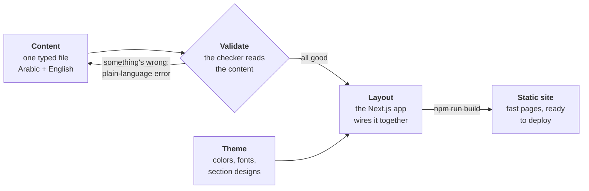

# nabcor docs — start here

This is the front door to the nabcor documentation. Read this page first, then open the one doc that matches what you need to do.

**Before you start:** nothing. You only need this page open. If you want to follow along on a computer, you need the nabcor project downloaded and [Node.js](https://nodejs.org) version 20 or newer installed.

**How long it takes:** about 10 minutes to read.

**How you'll know it worked:** by the end you'll know what nabcor is, how a nabcor website is put together, and exactly which other doc to open next.

---

## What nabcor is

nabcor is the shared starting point for every Nabtiq client website. Instead of building each site from scratch, we build them all the same way, on top of one shared core and a reference theme.

Think of it like this. A car factory doesn't invent the engine, the wheels, and the safety belts fresh for every car. It has a shared platform, and each new model reuses it. nabcor is that shared platform for websites.

It gives every site:

- A fixed, checked structure for the words and pictures on the page.
- Ready-made building blocks: header, footer, contact form, and the standard page sections.
- The search-engine and social-sharing plumbing (sitemaps, previews, and so on) already wired up.
- A tested recipe for putting the finished site on the internet.

A website is a text file, not a login. There is no separate admin website to log into and no database. Everything a site says lives in one typed file that ships with the site. That is a deliberate choice, and it comes from looking at five real Nabtiq websites that were already running well this way.

nabcor is split into a few parts:

- **The core** (`packages/core`) — the shared engine. The page structure, the checker that catches mistakes, the building-block components, the search-engine plumbing, the contact form, and the deployment templates.
- **The reference theme** (`packages/theme-novalt`) — a complete, good-looking example theme for a made-up company called "Novalt." It shows what a finished theme looks like and is the thing you copy when you build a new one.
- **The demo app** (`apps/demo`) — a real, working website that uses the core and the theme together. It runs in Arabic and English. It is the thing you clone to start a new site.

---

## The three-layer model

Every nabcor site is made of three layers. Keeping them separate is the whole idea. Each layer has one job, and you can change one without disturbing the others.

### Layer 1 — Content: what the site says

This is the words, and which pictures go where. The business name, the tagline, the list of services, the client projects, the phone number.

It lives in one text file (a content file, ending in `.ts`). Every piece of human text is written in both Arabic and English side by side, so the same file powers both language versions of the site.

Before that file is ever used, a checker reads it and confirms nothing is missing or malformed. If something is wrong, it prints the problem in plain language instead of letting a broken site get built.

### Layer 2 — Theme: how the site looks

This is the colors, the fonts, the spacing, the shape of every section on the page. The reference theme, Novalt, is violet and editorial. A different client would get a different theme, but the same content would still fit it.

A theme is a small package the site depends on. It is chosen when the site is built, not while visitors are browsing. Swap the theme package, rebuild, and the same words appear in a completely different look.

There is a safety net here. The theme has to provide a design for *every* kind of section the content can contain. If it forgets one, the site refuses to build and points at the gap. You cannot ship a half-finished theme by accident.

### Layer 3 — Layout: how it's all wired together

This is the actual website program (built with Next.js) that takes the content, dresses it in the theme, and produces the finished pages. It handles the two languages, sets the page direction correctly for Arabic (right-to-left) on the server so there's no flicker, and turns everything into plain, fast web pages.

When you start a new site, you copy the demo app, drop in the client's content file, point it at a theme, and add the brand's images. The three layers snap together.

---

## How a site gets built, step by step

Here is the whole journey, from the content file to a finished website ready to put online.



In words:

1. **Content** is written in the content file — the words and pictures, in both languages.
2. **Validate** checks it. If something's missing or wrong, it stops and tells you in plain language, and you go fix the content. If everything's fine, it moves on.
3. **Theme** provides the look, and **Layout** (the app) combines the checked content with the theme.
4. **Build** turns all of that into a finished **static site** — a set of plain, fast web pages you can put on the internet.

---

## The commands you'll use

You run these from the top folder of the project. Copy and paste them as-is.

Install everything the project needs (do this once, first):

```bash
npm install
```

Check a content file for mistakes:

```bash
npm run validate-content
```

See the checker catch a deliberately broken file (a demo of the safety net):

```bash
npm run validate-content -- broken
```

Run the site on your own computer to look at it:

```bash
npm run dev
```

Build the finished site:

```bash
npm run build
```

Check that the site is usable for people with disabilities:

```bash
npm run test:a11y
```

Check that all the types line up (a deeper technical check):

```bash
npm run typecheck
```

---

## Where to go next

Each doc below is written for a specific person and a specific job. Open the one that matches you.

| Doc | What it's for | Who should read it |
| --- | --- | --- |
| [install-a-site.md](./install-a-site.md) | Get a nabcor site running on your own computer, start to finish. | Anyone setting up a site for the first time. No prior experience assumed. |
| [client-intake-protocol.md](./client-intake-protocol.md) | Turn the messy pile a client sends (a huge PDF, a Word brochure, dozens of unnamed phone photos) into clean, organized content. | Whoever collects and sorts the client's material before a site is built. |
| [image-naming-convention.md](./image-naming-convention.md) | The mandatory rules for naming image files and where each one goes. | Anyone adding logos, hero images, service photos, or project photos to a site. |
| [build-a-theme.md](./build-a-theme.md) | Make a brand-new look by copying the reference theme and changing colors, fonts, and section designs. | Whoever is creating the visual design for a client. Some comfort with code helps. |
| [deferred-decisions.md](./deferred-decisions.md) | The things nabcor deliberately does *not* do yet, and why we left them out for now. | Anyone wondering "why can't nabcor do X?" before asking for it. |
| [architecture-decisions/](./architecture-decisions/) | The record of the big, locked-in choices — why App Router, why build-time themes, why typed content, and so on — each traced back to real projects. | Anyone who wants the reasoning behind how nabcor is built, or is proposing a change to it. |

If you're brand new and just want to see a site run, start with **[install-a-site.md](./install-a-site.md)**.

If a client just sent you a folder of files and you don't know where to begin, start with **[client-intake-protocol.md](./client-intake-protocol.md)**.
